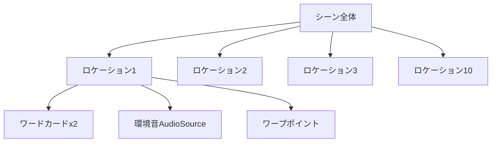

# シーン設計.md

---

## 1. 全体方針

- 1つのUnityシーンに10ロケーション（部屋）を物理的に配置
- 各ロケーションには「ワードカード（2枚）」と「環境音」を個別に用意
- ユーザーはワープ（またはドア）でロケーション間を移動
- 進行状況やカード配置、実験データなどをリアルタイムで記録・保存
- パフォーマンス・品質・拡張性・保守性を重視

---

## 2. システム要件

### 機能要件
- 10の異なる空間をVRで再現
- 空間オーディオと非空間オーディオの切り替え
- 単語カードの配置と管理
- 実験データの記録
- 進行状況の表示

### 非機能要件
- 72FPS以上を維持
- 音声遅延50ms以下
- 長時間の安定動作
- 新ロケーション追加の容易さ
- コードの可読性・再利用性

---

## 3. 構築・設計の順序

### ① ロケーションの物理配置

- 10部屋分の3Dモデル（Blender等で作成済み）をシーン内に等間隔で配置（例：Z軸方向に10mごと）
- 各部屋の入口や中心に「ワープポイント（Transform）」を設置
- 部屋同士の距離は十分に離し、音声やオブジェクトの干渉を防ぐ
- 各部屋のサイズ：5m x 5m x 3m（統一）

### ② モデル・アセット最適化

- ポリゴン数：10,000以下／テクスチャサイズ：2048x2048以下
- 静的バッチング・LOD（3段階）・コライダー最適化
- Addressablesによる動的ロード・アンロード
- マテリアル・テクスチャの一元管理

### ③ ワープ・移動システムの実装

- LocationManagerスクリプトでワープポイント配列を管理
- UIボタンやコントローラー入力で「WarpToLocation(int index)」を呼び出し、XR Origin（カメラリグ）をワープポイントに移動
- ワープ時はフェード演出や「ワープ可能」UI表示でUX向上
- ドア移動も併用可能

### ④ ロケーション訪問順の管理

- 訪問順は2パターンを用意：
  - ケース1：1→2→3→…→10（順番通り）
  - ケース2：3→7→1→10→2→5→8→4→9→6（固定ランダム順）
- どちらもList<int>で管理し、進行制御やログ記録に利用

#### サンプルコード
```csharp
using System.Collections.Generic;
using UnityEngine;

public class LocationOrderExample : MonoBehaviour
{
    public List<int> orderCase1; // 順番通り
    public List<int> orderCase2; // 固定ランダム順

    void Start()
    {
        // ケース1: 1→2→3→…→10
        orderCase1 = new List<int> { 1,2,3,4,5,6,7,8,9,10 };

        // ケース2: 固定ランダム順
        orderCase2 = new List<int> { 3, 7, 1, 10, 2, 5, 8, 4, 9, 6 };
    }
}
```

### ⑤ ロケーション訪問順のUI表示

- TextMeshProUGUIなどで訪問順を画面に表示

```csharp
using TMPro;
public class LocationOrderUI : MonoBehaviour
{
    public TextMeshProUGUI orderText;
    public List<int> visitOrder;
    void Start()
    {
        visitOrder = new List<int> { 3, 7, 1, 10, 2, 5, 8, 4, 9, 6 };
        ShowOrderOnUI();
    }
    public void ShowOrderOnUI()
    {
        orderText.text = "訪問順: " + string.Join(" → ", visitOrder);
    }
}
```

### ⑥ ロケーション訪問順のCSV出力

- 訪問順をCSVファイルとして保存

```csharp
using System.IO;
public class LocationOrderCSV : MonoBehaviour
{
    public List<int> visitOrder;
    public void ExportOrderToCSV(string filePath)
    {
        string csvLine = string.Join(",", visitOrder);
        File.WriteAllText(filePath, csvLine);
        Debug.Log("CSV出力完了: " + filePath);
    }
}
```
- 例: `Application.persistentDataPath`を使うと安全
```csharp
string path = Path.Combine(Application.persistentDataPath, "visit_order.csv");
GetComponent<LocationOrderCSV>().ExportOrderToCSV(path);
```

### ⑦ ワードカードシステムの構築

- WordCardData（単語＋画像）のリストをScriptableObjectで管理
- WordCard（Prefab）を作成（TextMeshPro＋Image＋コライダー＋Rigidbody＋XR Grab Interactable）
- 各ロケーションにCardSpawnerを設置し、2枚ずつランダム配置
- XR Interaction Toolkitで掴み・離しを実装
- 配置順や配置位置をCardLoggerで記録し、DataLoggerと連携してCSV保存

### ⑧ ロケーションごとの音声システム

- 各部屋にAudioSourceを設置し、環境音（1分ループ・-28LUFS）を再生
- 空間オーディオ（spatialBlend=1.0）と非空間オーディオを切り替え可能
- AudioSettingsクラスで距離減衰や音量を調整
- ロケーション移動時に自動で音声を切り替える仕組みを追加

### ⑨ 進行状況・UIの実装

- ProgressUIDisplayで現在のロケーションや進行状況を表示
- ワープ可否やカード配置状況もUIで分かりやすく表示
- 必要時のみUIを表示するボタンを用意

### ⑩ 実験データ管理・記録

- ExperimentDataクラスで行動・カード配置・移動・進行状況・音声設定などを記録
- DataLoggerでCSV等に保存
- データ構造例：
  ```csharp
  [System.Serializable]
  public class ExperimentData {
      public string participantId;
      public int locationId;
      public float timestamp;
      public Vector3 position;
      public string action;
      public string cardId;
      public bool isSpatialAudio;
  }
  ```
- ログの完全性・エラー処理も考慮

### ⑪ テスト・最適化

- ロケーション間の音声漏れやオブジェクト干渉を確認
- パフォーマンス（FPS、メモリ）をチェック
- ユーザビリティテストで操作性・UXを評価
- 単体テスト・統合テスト・ユーザビリティテストを実施

---

## 4. 実装ガイドライン

- 命名規則（PascalCase, camelCase, UPPER_CASE）
- アクセス修飾子の明示
- 適切なコメント・エラー処理
- パフォーマンス最適化
- Addressablesによるアセット管理
- Blenderモデルのバージョン管理・最適化

---

## 5. 品質管理・チェックリスト

- FPS：72以上
- CPU/GPU Timings：13.8ms以下
- メモリ使用量：2GB以下
- Quest 3の6DoF動作確認
- AirPods ProのAV同期遅延確認
- データログの完全性確認
- 各ロケーション間の音声漏れ防止確認

---

## 6. サンプル構成図（イメージ）



---

## 7. 参考スクリプト・設計例

- LocationManager（ワープ管理）
- CardSpawner（カード配置）
- CardLogger/DataLogger（データ記録）
- ProgressUIDisplay（進行状況UI）
- AudioSettings/AudioController（音声制御）

---

## 8. まとめ

この手順・設計順序に沿って進めれば、  
「10ロケーション＋ワードカード＋音声＋ワープ移動＋データ記録＋品質管理」  
という一連のVR実験シーンを、迷わず・効率的に構築できます。

---

さらに詳細なサンプルコードやUnityエディタでの具体的な配置例が必要な場合は、随時追記・相談してください。 