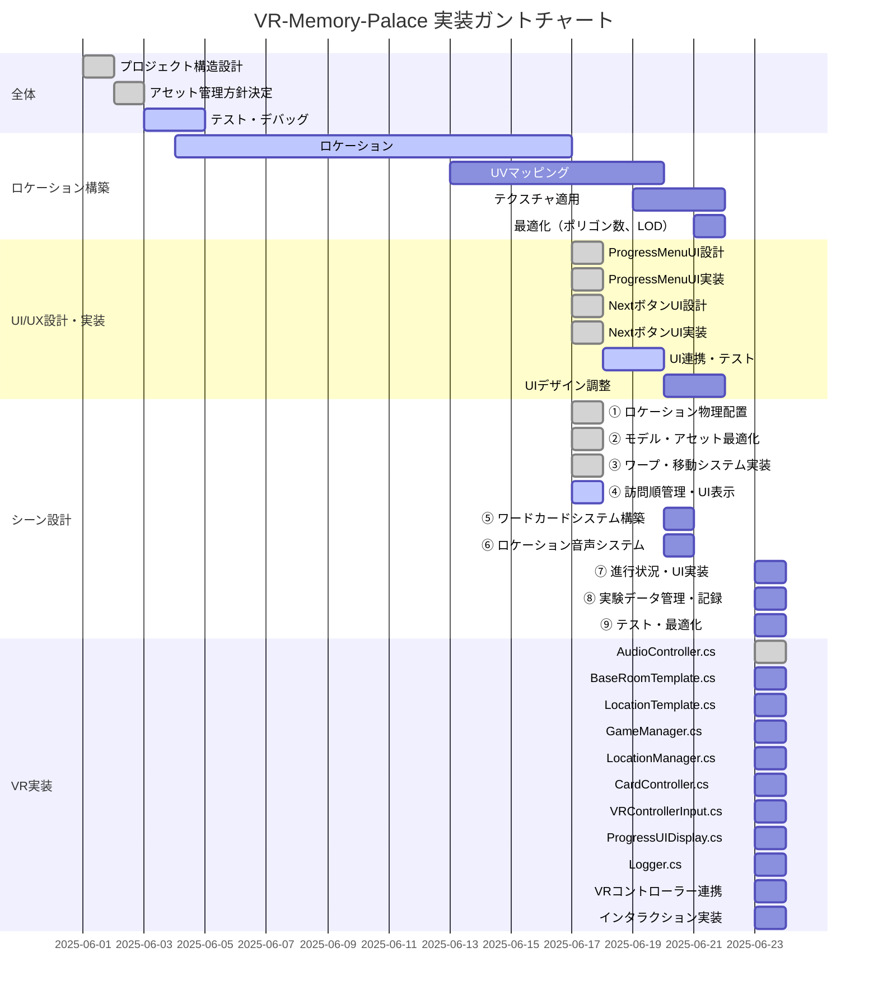

```mermaid

gantt

    title VR-Memory-Palace 実装ガントチャート

    dateFormat  YY-MM-DD

  

    section 全体

    プロジェクト構造設計         :done, 2025-06-01, 1d

    アセット管理方針決定         :done, 2025-06-02, 1d

    テスト・デバッグ             :active, 2025-06-03, 2d

  

    section ロケーション構築

    ロケーション           :active, 2025-06-04, 13d

    UVマッピング                 :todo, 2025-06-13, 7d

    テクスチャ適用               :todo, 2025-06-19, 3d

    最適化（ポリゴン数、LOD）    :todo, 2025-06-21, 1d

    section UI/UX設計・実装

    ProgressMenuUI設計           :done, 2025-06-17, 1d

    ProgressMenuUI実装           :done, 2025-06-17, 1d

    NextボタンUI設計             :done, 2025-06-17, 1d

    NextボタンUI実装             :done, 2025-06-17, 1d

    UI連携・テスト               :active, 2025-06-18, 2d

    UIデザイン調整               :todo, 2025-6-20, 2d

  

    section シーン設計

    ① ロケーション物理配置         :done, 2025-06-17, 1d

    ② モデル・アセット最適化       :done, 2025-06-17, 1d

    ③ ワープ・移動システム実装     :done, 2025-06-17, 1d

    ④ 訪問順管理・UI表示           :active, 2025-06-17, 1d

    ⑤ ワードカードシステム構築     :todo, 2025-06-20, 1d

    ⑥ ロケーション音声システム     :todo, 2025-06-20, 1d

    ⑦ 進行状況・UI実装             :todo, 2025-06-23, 1d

    ⑧ 実験データ管理・記録         :todo, 2025-06-23, 1d

    ⑨ テスト・最適化               :todo, 2025-06-23, 1d

  

    section VR実装

    AudioController.cs           :done, 2025-06-23, 1d

    BaseRoomTemplate.cs          :todo, 2025-06-23, 1d

    LocationTemplate.cs          :todo, 2025-06-23, 1d

    GameManager.cs               :todo, 2025-06-23, 1d

    LocationManager.cs           :todo, 2025-06-23, 1d

    CardController.cs            :todo, 2025-06-23, 1d

    VRControllerInput.cs         :todo, 2025-06-23, 1d

    ProgressUIDisplay.cs         :todo, 2025-06-23, 1d

    Logger.cs                    :todo, 2025-06-23, 1d

    VRコントローラー連携         :todo, 2025-06-23, 1d

    インタラクション実装         :todo, 2025-06-23, 1d

  

```